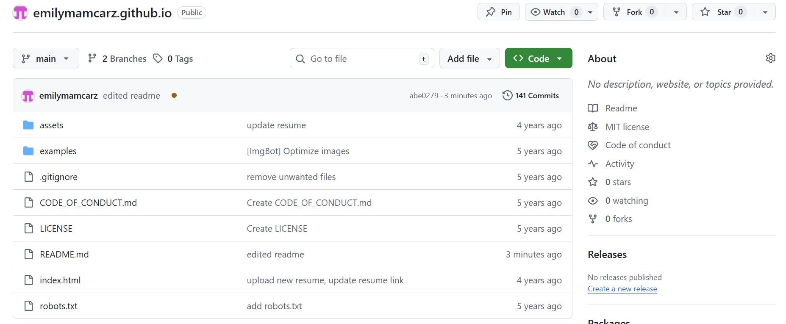
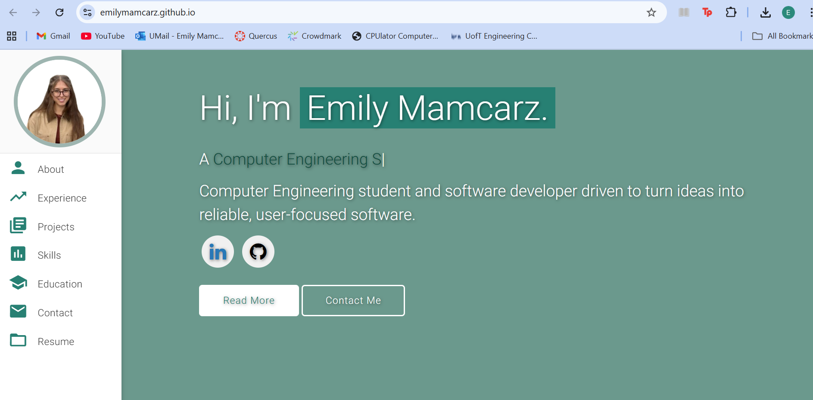
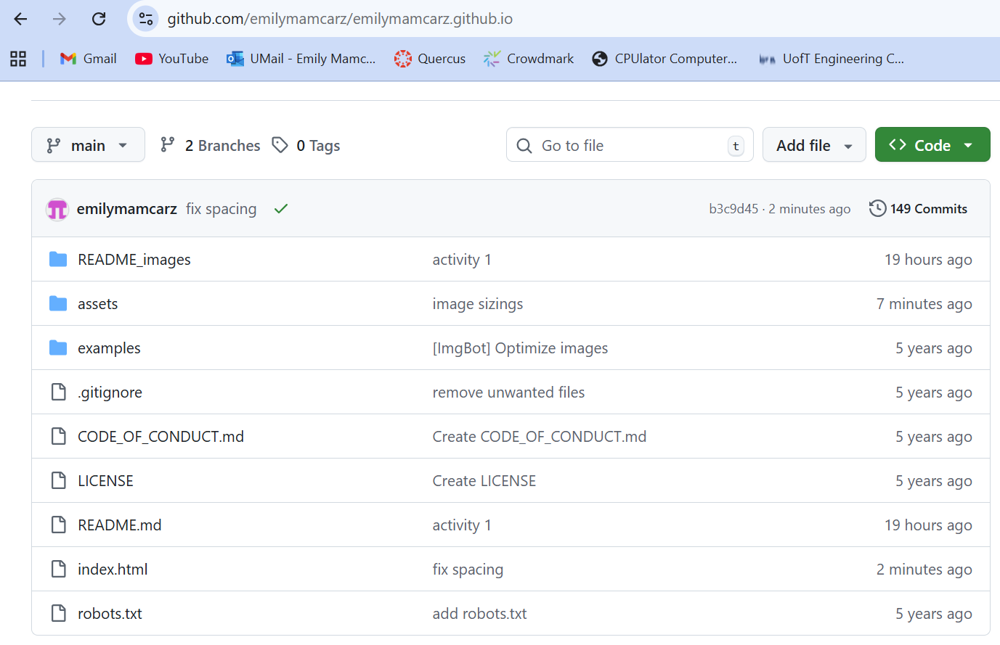
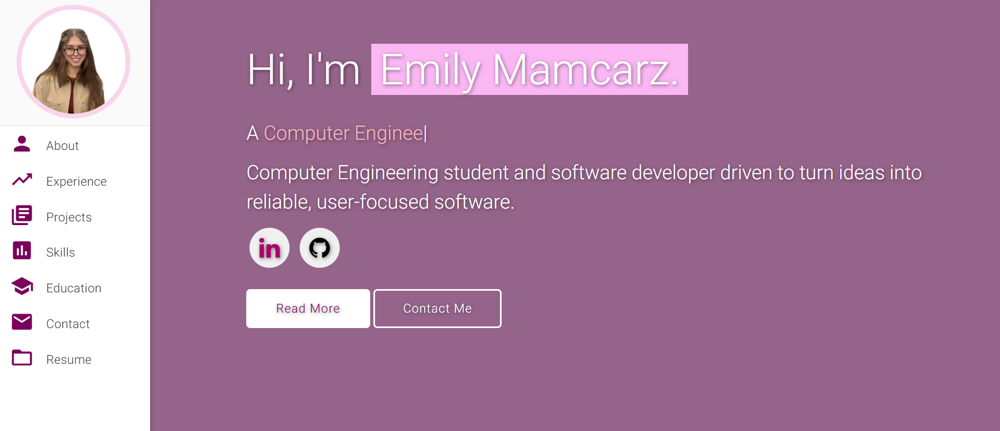
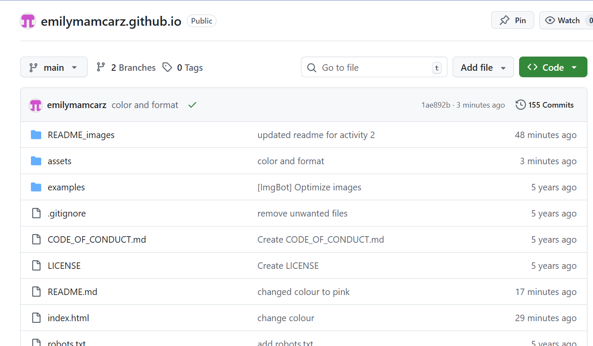

# Personal Portfolio: Emily Mamcarz
> A clean, beautiful, responsive portfolio template for Software Developers!

## Note
This repo is a clone of **[https://github.com/varadbhogayata/varadbhogayata.github.io](https://github.com/varadbhogayata/varadbhogayata.github.io)**

## Sections 📚
✔️ About me\
✔️ Experience\
✔️ Projects \
✔️ Skills \
✔️ Education\
✔️ Contact Info\
✔️ Resume

To view a live example, **[click here](https://emilymamcarz.github.io/)**

## PRA #1 Deliverables:

### Activity-1: Cloning personal website repo into your own GitHub account.

### Activity-2: Adding your personal information.

### Activity-3: Changing the Theme Color of Your Personal Website

